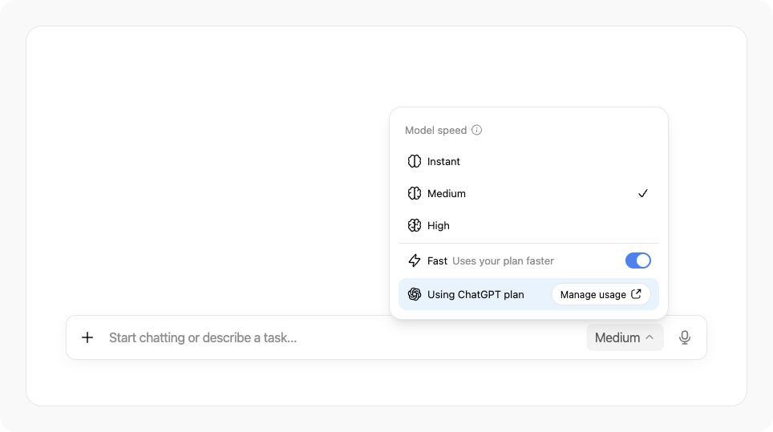
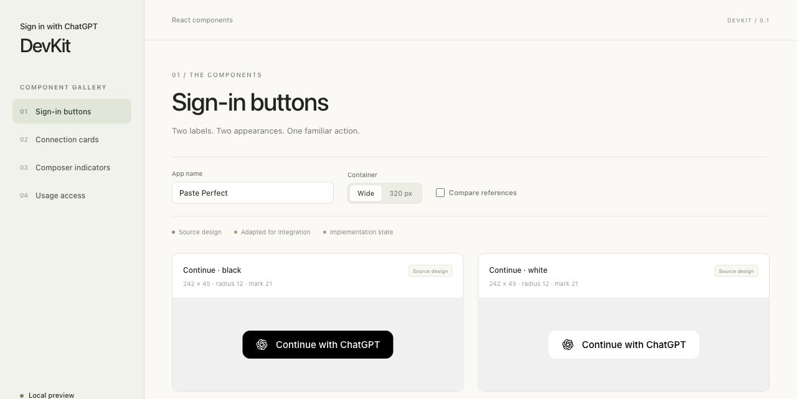

# Sign in with ChatGPT DevKit

[Sign in with ChatGPT](https://learn.chatgpt.com/docs/sign-in-with-chatgpt) lets users sign in to your app with their ChatGPT account. With their permission, eligible users can also use their ChatGPT plan to power your app's AI features without setting up an API key.

<p>
  
  
</p>

This DevKit is for developers building open-source apps that run on a user's own machine. It gives you a local Node.js SDK, React components, and design assets to integrate Sign in with ChatGPT, plus Paste Perfect, a working macOS example app you can learn from.



## Use the DevKit in your app

Follow the [Paste Perfect cookbook](https://developers.openai.com/cookbook/articles/sign-in-with-chatgpt) for a step-by-step integration. See the [developer documentation](https://developers.openai.com/siwc) for authentication and ChatGPT plan usage.

Use `@siwc/local` in your app's local Node.js process for sign-in and API requests, and `@siwc/react` for the UI. Import `@siwc/react/styles.css` once. Both packages are local workspaces in this repository; [Paste Perfect](examples/paste-perfect) shows how to connect them, including [OS-encrypted credential storage](docs/security.md).

## What's included

| Folder | Contents |
| --- | --- |
| [`packages/local`](packages/local) | OAuth, credential storage, account profiles, model discovery, and streaming Responses. |
| [`packages/react`](packages/react) | React components for sign-in, connection status, and ChatGPT plan usage. |
| [`assets`](assets) | ChatGPT marks, icons, sign-in buttons, and fonts. |
| [`examples/component-gallery`](examples/component-gallery) | Design examples for sign-in, account connections, and ChatGPT plan usage controls. |
| [`examples/paste-perfect`](examples/paste-perfect) | An example native macOS app that uses Sign in with ChatGPT to transform copied text and paste the result into another app, with an Electron settings dashboard. |

## Running the example Paste Perfect app with Sign in with ChatGPT

Requires macOS 14 or later, Node.js 22.12 or later, and Xcode Command Line Tools.

```sh
git clone https://github.com/openai/sign-in-with-chatgpt-devkit.git
cd sign-in-with-chatgpt-devkit
npm ci
npm run build
npm start
```

1. Sign in with ChatGPT from the dashboard.
2. Enable native paste and grant Accessibility access to the native helper.
3. Copy text, focus an editable field in another app, press **⌘⇧Space**, then right-click within eight seconds.
4. Choose Spreadsheet, Message, Translate, Checklist, Clean up, or a saved recipe.

The result is pasted into the destination app. Use the Electron dashboard to manage accounts, settings, recipes, and activity. Paste Perfect currently supports text on macOS; compatibility varies by destination app.

## Branding and Design Guidelines

Use the [UI/UX guidelines](https://developers.openai.com/siwc/ui-ux-guidelines) and [design assets](assets/README.md) to add a familiar sign-in experience, show which ChatGPT account is connected, and make plan usage controls easy to find. Try the components with your app's name and layout to choose button styles, check connection states, and place usage indicators where users need them.



To try the designs locally after installing dependencies:

```sh
npm run dev:gallery
```

Open the local URL printed in your terminal.

## Licence

OpenAI-authored code and documentation are licensed under the [Sign-in with ChatGPT DevKit Noncommercial License v1.0](LICENSE). Third-party fonts and dependencies retain their own licences; see [third-party notices](THIRD_PARTY_NOTICES.md) and the [dependency inventory](docs/dependency-inventory.json). OpenAI trademarks remain subject to the [OpenAI brand guidelines](https://openai.com/brand/).

Bundled Inter and Open Sans fonts include their licence files. SF Pro uses the system font on Apple platforms and falls back on other platforms.

For contribution policy, see [CONTRIBUTING.md](CONTRIBUTING.md).
